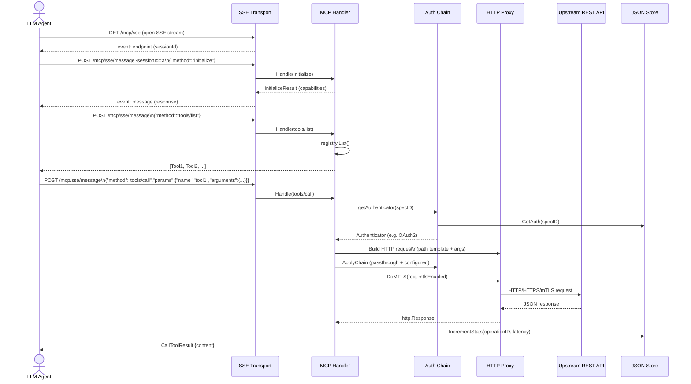
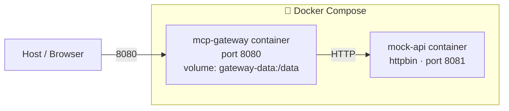

# MCP Gateway — Architecture Diagrams

## 1. System Architecture

```mermaid
graph TB
    subgraph Clients["🖥️ Clients"]
        LLM["LLM / AI Agent\n(MCP Client)"]
        BROWSER["Admin Browser\n(React SPA)"]
        PROM["Prometheus Scraper"]
    end

    subgraph Gateway["🚀 MCP Gateway (Single Binary · Go)"]
        direction TB

        subgraph HTTP_Layer["HTTP Layer (net/http + cmux)"]
            CMUX["cmux\nTLS/HTTP Multiplexer\n:8080"]
        end

        subgraph MCP_Transport["MCP Transport Layer"]
            SSE["SSE Server\nGET  /mcp/sse\nPOST /mcp/sse/message"]
            HTTPT["HTTP Transport\nPOST /mcp/http"]
        end

        subgraph Admin_Layer["Admin Layer"]
            ADMIN_ROUTER["Admin Router\n/_api/* · /_auth/*\n/_ui/*  · /metrics"]
            LOGIN["Login Handler\n/_auth/login|logout"]
            SPECS_API["Specs API\n/_api/specs"]
            OPS_API["Operations API\n/_api/specs/{id}/operations"]
            RES_API["Resources API\n/_api/resources"]
            STATS_API["Stats API\n/_api/stats · /health"]
            CHAT_API["Chat Proxy\n/_api/chat/completions"]
            UI["Embedded React UI\nGET /_ui/*\n(Vite SPA, embed.FS)"]
        end

        subgraph Core["Core Engine"]
            HANDLER["MCP Handler\nmcp.HandlerDeps\ninitialize · tools/list\ntools/call · resources/*"]
            REGISTRY["In-Memory Registry\ntools map + resources\npub/sub notifications"]
            AUTH_CHAIN["Auth Chain\npassthrough → configured"]
        end

        subgraph Infra["Infrastructure Modules"]
            SPEC_PARSE["OpenAPI Spec Parser\nkin-openapi · extractor"]
            PROXY["HTTP Proxy Client\nmTLS / plain TLS\nper-host conn pools"]
            STORE["JSON Store\ndata/ directory\nspecs · ops · auth\nstats · resources"]
            TELEMETRY["Telemetry\nPrometheus metrics\nslog structured logs"]
            TLSUTIL["TLS Util\ncert load · mTLS config"]
            AUTH_MOD["Auth Module\napi-key · bearer · basic\noauth2 (token cache)"]
            CONFIG["Config\nconfig.toml + env vars\nTLS · CORS · MTLS"]
        end
    end

    subgraph External["☁️ External Services"]
        UPSTREAM["Upstream REST APIs\n(HTTP/HTTPS/mTLS)"]
        OPENAI["OpenAI API\nchat completions"]
    end

    subgraph Storage["💾 Storage"]
        DATADIR["data/ (JSON files)\nspecs.json · ops.json\nauth/*.json · stats.json\nresources/"]
    end

    %% Client → Gateway
    LLM -->|"HTTP/SSE\nMCP JSON-RPC 2.0"| CMUX
    BROWSER -->|"HTTPS / HTTP"| CMUX
    PROM -->|"GET /metrics"| CMUX

    %% cmux → routes
    CMUX --> MCP_Transport
    CMUX --> ADMIN_ROUTER

    %% Admin router fan-out
    ADMIN_ROUTER --> LOGIN
    ADMIN_ROUTER --> SPECS_API
    ADMIN_ROUTER --> OPS_API
    ADMIN_ROUTER --> RES_API
    ADMIN_ROUTER --> STATS_API
    ADMIN_ROUTER --> CHAT_API
    ADMIN_ROUTER --> UI

    %% MCP transport → handler
    SSE -->|"JSON-RPC request"| HANDLER
    HTTPT -->|"JSON-RPC request"| HANDLER

    %% Handler dependencies
    HANDLER --> REGISTRY
    HANDLER --> AUTH_CHAIN
    HANDLER --> PROXY
    HANDLER --> STORE

    AUTH_CHAIN --> AUTH_MOD

    %% Admin ops → registry rebuild
    SPECS_API -->|"parse + register"| SPEC_PARSE
    SPEC_PARSE -->|"ToolDefinitions"| REGISTRY
    SPECS_API --> STORE
    OPS_API --> STORE
    OPS_API -->|"rebuild"| REGISTRY
    RES_API --> STORE
    RES_API -->|"rebuild"| REGISTRY

    %% Registry → SSE notifications
    REGISTRY -->|"tools/list_changed\nSSE notification"| SSE

    %% Proxy → upstream
    PROXY -->|"HTTP/HTTPS/mTLS"| UPSTREAM
    TLSUTIL -->|"mTLS config"| PROXY

    %% Chat proxy → OpenAI
    CHAT_API -->|"HTTPS Bearer token\n(server-side key)"| OPENAI

    %% Store ↔ filesystem
    STORE <-->|"read/write JSON"| DATADIR

    %% Telemetry hooks
    HANDLER -->|"counters · histograms"| TELEMETRY
    REGISTRY -->|"gauge: tools count"| TELEMETRY
    SSE -->|"gauge: active sessions"| TELEMETRY

    %% Config wires
    CONFIG -.->|"loaded at startup"| CMUX
    CONFIG -.-> AUTH_MOD
    CONFIG -.-> PROXY

    %% Styling
    classDef client fill:#4A90D9,stroke:#2C5F8A,color:#fff
    classDef transport fill:#7B68EE,stroke:#5A4FBB,color:#fff
    classDef admin fill:#20B2AA,stroke:#148C87,color:#fff
    classDef core fill:#FF8C00,stroke:#CC7000,color:#fff
    classDef infra fill:#708090,stroke:#4F6070,color:#fff
    classDef external fill:#DC143C,stroke:#A01030,color:#fff
    classDef storage fill:#228B22,stroke:#145514,color:#fff

    class LLM,BROWSER,PROM client
    class SSE,HTTPT,CMUX transport
    class ADMIN_ROUTER,LOGIN,SPECS_API,OPS_API,RES_API,STATS_API,CHAT_API,UI admin
    class HANDLER,REGISTRY,AUTH_CHAIN core
    class SPEC_PARSE,PROXY,STORE,TELEMETRY,TLSUTIL,AUTH_MOD,CONFIG infra
    class UPSTREAM,OPENAI external
    class DATADIR storage
```

---

## 2. Tool Call Sequence Diagram

---

## 3. Deployment Diagram

**Deployment notes:**
- Single Docker image built from `Dockerfile`; data persisted in a named volume
- TLS + HTTP served on the **same port** via `cmux`; mTLS client certs supported for upstream calls
- Config via `config.toml` or env vars (`LISTEN_ADDR`, `GATEWAY_SECRET`, `ADMIN_PASSWORD`, `OPENAI_API_KEY`, …)
- Prometheus metrics at `/metrics`; `slog` structured logging to stdout
- React SPA is statically embedded in the binary via `go:embed ui/dist`
